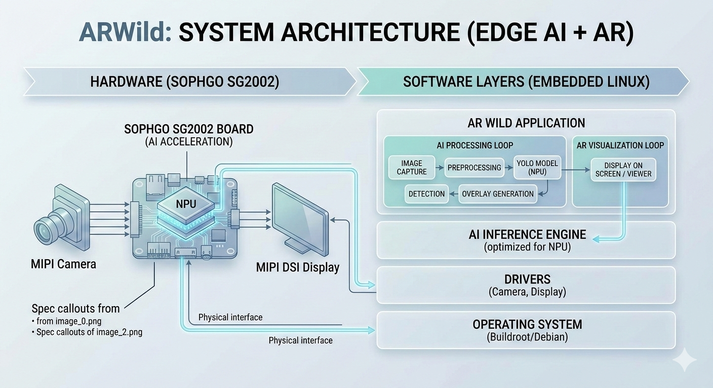
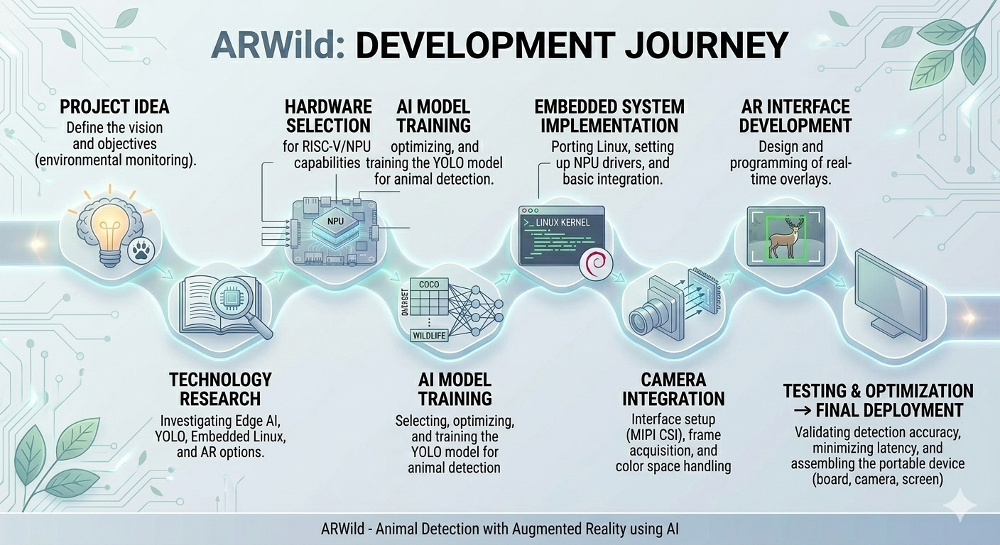
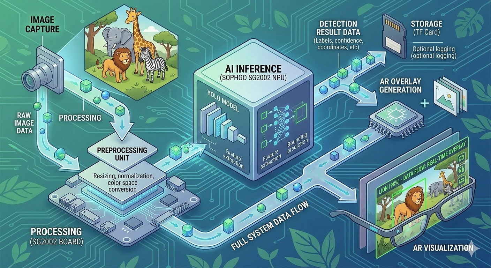

# 🐾 ARWild - Animal Detection with Augmented Reality using AI

## 📌 Project Description

ARWild is a portable **computer vision system powered by artificial intelligence** that enables **real-time animal detection and visualization through an augmented reality (AR) interface**.

The system uses an embedded device with **AI acceleration (NPU)** to run **YOLO-based object detection models**, together with a camera and a visualization system (screen or optical viewer similar to *smart glasses*).

When an animal is detected, visual information is displayed over the real-world environment, allowing **immediate species identification through graphical overlays**.

This project focuses on demonstrating a **functional proof of concept**, prioritizing system feasibility over full product-level integration.

It aims to explore how **AI + embedded systems + augmented reality** can be applied to:

- environmental monitoring  
- education  
- wildlife observation  
- biodiversity conservation  

---

# 🌍 Relation to the SDGs

This project mainly contributes to the following **Sustainable Development Goals (SDGs)**.

### SDG 15 – Life on Land

The system can be used for:

- wildlife monitoring  
- species identification  
- environmental conservation support  
- ecological education  

### SDG 9 – Industry, Innovation and Infrastructure

It promotes the development of:

- intelligent embedded systems  
- Edge AI devices  
- new technological applications for environmental protection  

---

# 🎯 Project Objective

To develop a **portable animal detection system with augmented visualization capabilities** that:

- detects animals in near real time using **YOLO**
- runs AI inference on **embedded hardware**
- displays detection results through a visual interface (screen or AR-like system)
- operates locally without internet dependency  

---

# 💡 Motivation

Observing animals in natural environments often requires experience to quickly identify species.

This project aims to:

- democratize access to wildlife identification tools  
- support environmental education  
- explore real-world applications of **Edge AI**  

It also demonstrates how low-power devices can run **computer vision models locally without relying on cloud computing**.

---

# 🧠 Technologies Used

- Computer Vision  
- Artificial Intelligence  
- YOLO Object Detection  
- Edge AI  
- Embedded Systems  
- Embedded Linux  
- Augmented Reality  

---

# 🧩 Project Hardware

The system uses a board based on the **SOPHGO SG2002 processor**.

### Main Specifications

| Component | Description |
|---|---|
| CPU | SOPHGO SG2002 |
| Main Core | 1GHz RISC-V C906 / ARM A53 |
| Secondary Core | 700MHz RISC-V |
| Low Power Core | 8051 (25–300 MHz) |
| NPU | 1 TOPS INT8 |
| Memory | 256MB integrated DDR3 |
| Storage | TF Card / SD NAND |
| Camera | MIPI CSI (4 lane) |
| Display | MIPI DSI |
| Audio | Integrated microphone and amplifier |
| Connectivity | WiFi 6 + BLE 5.4 |
| USB | USB 2.0 Type-C |
| Operating System | Linux (Buildroot / Debian) |

---

# 🖥 System Architecture

---

# 🧭 Project Development Stages

---

# 📋 System Requirements

## 🔰 Minimum Viable Requirements (MVP)

The system must:

- Capture video input in real time (low resolution allowed)
- Perform animal detection using a lightweight YOLO-based model
- Detect a limited number of species (e.g., 2–5 classes)
- Display results visually (bounding boxes and labels)
- Run fully offline (no cloud dependency)
- Execute inference locally on the embedded device

---

## 🟡 Optional Features (Non-Critical)

- Display confidence scores  
- Support more species  
- Improve AR-style visualization  
- Add audio feedback  
- Enhance UI/UX  

---

## ⚙️ Performance Expectations (Non-Functional)

The system is not expected to reach commercial-level performance:

- **Latency:** up to 1 second  
- **FPS:** 5–10 FPS  
- **Accuracy:** ~60–80%  
- **Power:** portable (power bank)  
- **Portability:** compact but not necessarily wearable  

### 🌡️ Environmental & Operational Requirements

- Operate within **0°C to 40°C**
- Maintain performance under variable lighting
- Tolerate moderate humidity
- Handle partial visibility (fog, dust, light rain)
- Degrade gracefully under adverse conditions

---

# ⚠️ System Constraints

## 🔻 Hardware Constraints

- 256MB RAM limitation  
- 1 TOPS NPU performance limit  
- Limited storage and power  
- Thermal limitations due to compact design  
- No active cooling system  

This requires:

- lightweight models (YOLO Tiny / Nano)  
- model quantization (INT8)  
- reduced input resolution  

---

## 🔻 Software Constraints

- Limited compatibility with RISC-V / ARM  
- Restricted AI framework support  
- Embedded Linux limitations  

---

## 🔻 Design Constraints

- Full smart glasses integration is **not required**  
- Device size and weight may exceed wearable limits  
- AR visualization can be simulated using a normal display  
- Passive cooling only (no fan)
- Basic environmental protection required for outdoor use  

The project prioritizes **functionality over miniaturization**.

---

# 🌡️ Environmental Operating Conditions

## Overview

The system is designed for outdoor use where environmental factors directly affect performance.

---

## Temperature

- High temperature → thermal throttling, lower FPS  
- Mitigation: heatsink, dynamic FPS scaling  

---

## Lighting

- Affects detection accuracy  
- Mitigation: adaptive exposure, robust training  

---

## Humidity

- Risk of condensation  
- Mitigation: enclosure, lens protection  

---

## Weather

- Rain/fog reduce visibility  
- Mitigation: preprocessing, dataset robustness  

---

## Power Interaction

- High load increases temperature and power usage  
- Mitigation: dynamic resource management  

---

# 🔄 System Flexibility & Adaptability

To ensure feasibility, the system supports multiple formats:

### Operation Modes

1. **Basic Prototype**
   - Camera + board + external display  

2. **Portable Device**
   - Self-contained with battery  

3. **AR Mode (Experimental)**
   - Optical viewer or smart glasses (if possible)  

4. **Alternative Output**
   - External screen (monitor, tablet, vehicle display)  

---

# 📉 Accepted Margin of Error

As a prototype, the system may:

- misclassify animals  
- run at low FPS  
- have detection delays  
- perform inconsistently in real environments  

These limitations are acceptable for validation purposes.

---

# 🎯 Key Engineering Principle

> The goal is to demonstrate a functional proof of concept for real-time animal detection using embedded AI, not to deliver a fully optimized commercial product.

---

# 🚧 Development Strategy Constraint

Development will follow progressive stages:

1. Validate detection on a standard display  
2. Optimize performance on embedded hardware  
3. Add portability (battery-powered system)  
4. Attempt AR integration (if feasible)  

AR is considered a **final-stage feature**, not a core requirement.

---

# 📊 Data Handling

## Data Sources

Training data will include:

- COCO dataset  
- Open Images Dataset  
- Wildlife datasets  

## Data Flow

## Storage

- Training datasets stored externally  
- Optimized model stored on SD card  
- Detection processed in memory  

---

# 🧪 Controlled Testing

### Test 1 – Basic Detection
Verify detection using static images.

### Test 2 – Real-Time Detection
Measure FPS, latency, and resource usage.

### Test 3 – Real Environment
Test in parks, reserves, or zoos under:

- different lighting conditions  
- temperature variation  
- real animal movement  
- partial occlusion  

---

# 📈 Performance Analysis

- Accuracy  
- Latency  
- Energy consumption  
- FPS  
- Thermal behavior  
- Performance under environmental stress  

---

# 🚀 Deployment

The system may be deployed as:

- embedded board  
- camera  
- display or viewer  
- portable battery  

### Possible formats:

**Option 1 – Screen-based system**  
Simple and reliable visualization  

**Option 2 – AR viewer (experimental)**  
Overlay using optical components  

---

# 🔬 AI Technologies

Uses **YOLO** for real-time detection.

Optimized for:

- low-power devices  
- edge inference  
- NPU execution  

---

# 📦 Project Structure

    project/
    │
    ├── model/
    │   ├── yolo_model.cvimodel
    │   └── labels.txt
    │
    ├── src/
    │   ├── main.c
    │   ├── inference.c
    │   ├── camera.c
    │   ├── display.c
    │
    ├── drivers/
    ├── scripts/
    ├── config/
    ├── build/
    └── README.md

---

# 🔮 Future Work

- detection of more animal species  
- GPS integration  
- wildlife observation logging  
- mobile app integration  
- advanced AR features  

---

# 👨‍💻 Development Team

Project developed by students for the **Intelligent Systems Prototyping course**.

---

# 📚 References

NI. (n.d.). *7 Steps in Creating a Functional Prototype*  
https://www.ni.com/es/solutions/design-prototype/7-steps-in-creating-a-functional-prototype.html  

YOLO Object Detection  
https://pjreddie.com/darknet/yolo/  

Edge AI Vision Alliance  
https://www.edge-ai-vision.com/  

---

# ⭐ Project Status

🚧 In development
